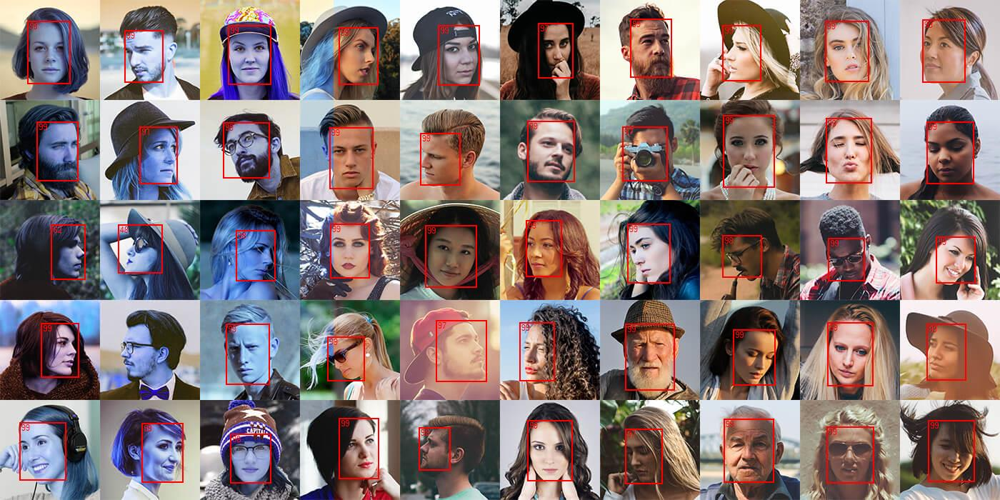

#  libfacetection.net
[](https://www.nuget.org/packages/libfacedetection.net/)
[](https://dev.azure.com/ricciolo/libfacedetection.net/_build/latest?definitionId=30&branchName=master)

This project is based on [libfacedetection](https://github.com/ShiqiYu/libfacedetection) implementation. A .NET wrapper calls native implementations compiled for [RIDs](https://docs.microsoft.com/en-us/dotnet/core/rid-catalog) win-x86, win-x64 and linux-x64
### [Live demo](https://ricciolo.github.io/libfacedetection.net/)



## Getting started
In order to start to use the library, install the [NuGet](https://www.nuget.org/packages/libfacedetection.net/) package first.
```powershell
dotnet add package libfacedetection.net
```
Create an instance of **CnnFaceDetector** and call the *Detect* method with a *Bitmap* (System.Drawing).
```csharp
// Load Bitmap
var bitmap = new Bitmap("file.jpg");

// Detect faces
var detector = new LibFaceDetection.CnnFaceDetector();
var result = detector.Detect(bitmap);

// Print rectangles
foreach (LibFaceDetection.CnnFaceDetected r in result)
{
    Console.WriteLine(r.Rectangle);
}
```
The *CnnFaceDetected* object contains also a **Confidence** property. You can use it to filter out found faces that could be some false positive.

Please note that **original bitmap is converted internally in BGR format**, thus after *Detect* call, your original bitmap will be compromised. Do not use it for further operations.

## Performances
For a better performance keep an instance of **CnnFaceDetector** for multiple usage, but please notice that the class is not thread safety. **Do not use it concurrently** from multiple threads. You can [ObjectPool<T>](https://docs.microsoft.com/dotnet/api/microsoft.extensions.objectpool.objectpool-1) available into *Microsoft.Extensions.ObjectPool* package to create a pool of available *CnnFaceDetector* instances. Please checkout a [sample here](tree/master/samples/AzureFunction)

You can also **speedup** the detection using a smaller image. You can downscale on your own, before passing it to the *Detect* method, or you can use an overload which accepts the maximum allowed image size.
```csharp
var result = detector.Detect(bitmap, new Size(400, 400));
```
The library resizes the bitmap mantaining aspect ratio. The result contains faces with rectangles relative to the original bitmap. The right bitmap size depends on the accurrancy you need. **Smaller image means faster detection, but lower quality**, and viceversa.

## Other image library integration
You are not bound to use Ssytem.Drawing. If you want to use other libraries, like MagicScaler, ImageSharp, FreeImage, the **Detect** method has an overloads which accepts a pointer to the raw bitmap. You also have to pass image size and stride.
Raw bitmap must be in **BGR** (better) or **RGB** format (a boolean allows to covert automatically), with a 8bit color depth.

## Credits
Thanks [nostromo117](https://github.com/nostromo117) for the logo