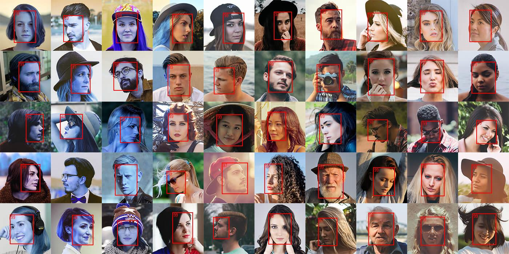

#  libfacetection.net

This project is based on [libfacedetection](https://github.com/ShiqiYu/libfacedetection) implementation. A .NET wrapper call native implementations compiled for [RIDs](https://docs.microsoft.com/en-us/dotnet/core/rid-catalog) win-x86, win-x64 and linux-x64

### Result

## Getting started
